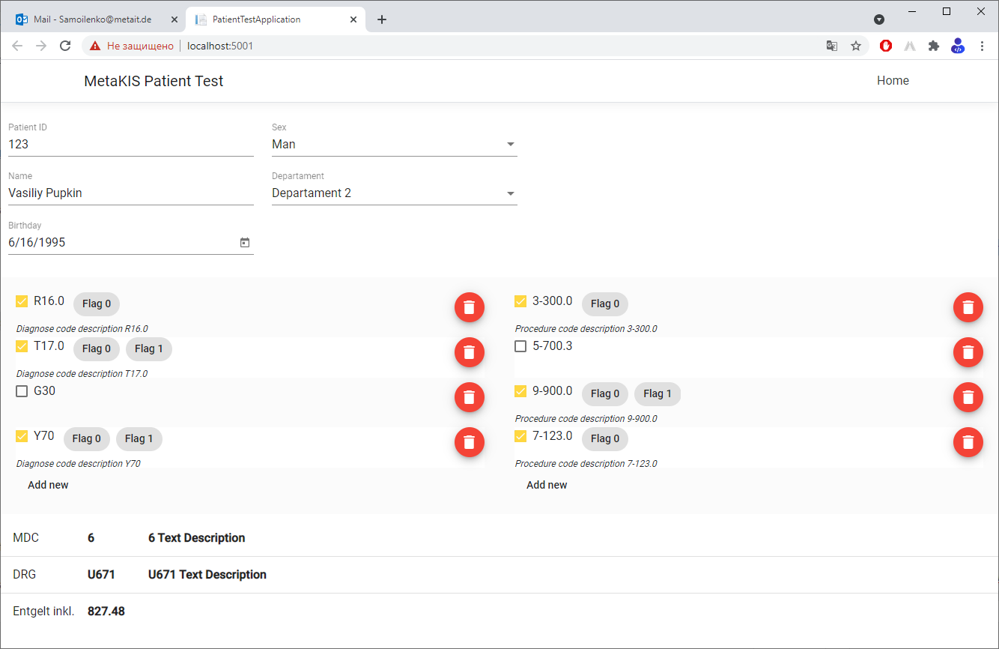

# PatientTestApplicationFrontend

## RU
### Тестовое задание для компании MetaIT GmbH

### Пример реального приложения

### Описание
Приложение состоит из 3 частей, выстроенных вертикально
- Панель демографических данных
  - Patient ID - идентификатор пациента (строка)
  - Name - имя пациента (строка)
  - Sex - пол (список из 3х возможных вариантов)
  - Birthday - дата рождения
  - DepartamentId  - идентификатор отделения, куда поступил пациент (выбор из списка возможных значений). Список возможных значений получается из сервиса.
- Панель диагнозов (слева) и процедур (справа)
  - Релизовать возможность добавления элементов в список, удаления, редактирования
  - Код - строка (напрмиер G40.2) - для тестового задания это любой набор символов
  - Флаг активности - чекбокс слева от кода - по умолчанию выбран, если отключить то код виден в интерфейсе, но не участвует в вычислении результата. Детальное описание будет ниже 
  - Флаги кодов диагнозов и процедур это разноцветные надписи справа от кода (результат)  
- Панель результатов
  - MDC - Основная диагностическая категория - код и опсиание (результат)
  - DRG - группа больничных случаев (результат)
  - Entgelt - стоимость лечения пациента (результат)

### Задание
- Реализовать приложение, позвонляющее ввести данные пациента - 5 демографических полей и список диагнозов и процедур.
- При любом изменении данных - сформировать `Patient` и вычислить результаты обсчета пациента с помошью сервиса `PatientService` - `PatientResult` и отобразить их.
  - `mdc`, `mdcDescription`, `drg`, `drgDescription`, `entgelt` вывести в Панели результатов
  - для каждого кода возвращается `description`, который нужно вывести под соотвествующим кодом диагноза и процедуры
  - для каждого кода возвращается массив `flags`, которые нужно вывести справа от кода в виде Badge
  - Флагом активности можно "выключить" код. 
      - Это означает что код диагноза или процедуры выводиться в интерфейсе, но он не попадает в структуру `Patient`
        Он не попадает в сервис и как следсвие не получает результат для этого кода. Для выключенного кода не отображаются description и flags, так как их нет.
      - Его можно включтить и тогда он снова получат результаты.
      - По умолчанию Флаг включен.
      - ВАЖНО: менять интерфейс `Patient`, `PatientResult` и сервис `PatientService` нельзя.  

### Дополнительно
- Ожидается, что время на выполнение проекта - 2-3 часа, но не больше 7 дней с момента получение задания.
- Стили, компоненты, библиотеки, архитектура - все на выбор исполнителя, требований нет

